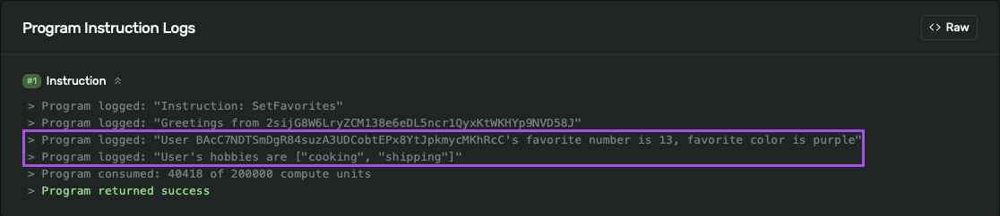

# CEOofNothing_SolanaBootcamp

CEOofNothing is transforming into a CEOofSomething, so she is learning Solana development. 

This Readme serves as a record of her progress through Solana's Blockchain Developer Bootcamp:
 - YouTube: https://youtu.be/amAq-WHAFs8?si=yXr4HZWtEj9Qssab
 - Github: https://github.com/solana-developers/developer-bootcamp-2024

## 24 November 2025 Achievements: 
1. Deployed Favorites program to Devnet:
   - Program: 2sijG8W6LryZCM138e6eDL5ncr1QyxKtWKHYp9NVD58J
   - TX: https://explorer.solana.com/tx/ie1QmZJYWmUcPi4uUWPQLSsn1eMZm4RrsQLeuXJed554JaMsWvK4pT6JvKHxeprpxQdAwpbYXrVGnmijx2JdKLZ?cluster=devnet
2. Wrote to the program successfully:
   - TX: https://explorer.solana.com/tx/2sbfvEqUc6Qv4QwUCaH9RKJFugMNPB54ViHBPfMWJRCfU89n8dVhfAkrWESGgdNMKeR7aUZUWikfrexFe4mxtqU5?cluster=devnet
   - New PDA created sucessfully: BMY74rhLrqEwkPzhz8fCcScHqXrEA81uhg2umEa3nnZk (for user: BAcC7NDTSmDgR84suzA3UDCobtEPx8YtJpkmycMKhRcC)
   - 😩 Found a bug in the instructions log, oh noooos!
   - [bug in instructions log](image.png)
3. Resolved the bug by correcting syntax in the program.
4. Upgraded the program:
   - https://explorer.solana.com/tx/5xTFhvJJr2a3QJ3gKpmMH9HAiPCsfAFocX1CB75byip54Awa5FiBBSMjaWVEzWKHWgDSdzZojtP6u3ZY8rm5LX2a?cluster=devnet
5. Wrote to the program again, this time seeing the expected result! 
   - https://explorer.solana.com/tx/5xaxfTC28VKY3L3XfvHQdkXM4dbTug46hXeeHhRQKRwEEkdCEd79iE4iVdqkK5QnbJdDjNrDyBxzqYafuj4Yk6L3?cluster=devnet
   - Same PDA as before: BMY74rhLrqEwkPzhz8fCcScHqXrEA81uhg2umEa3nnZk
   
6. Attempted to write to the program with new keys, but using previous user's PDA. It failed as expected. 
7. 💃 Did a happy dance.

---------------------------------------------------